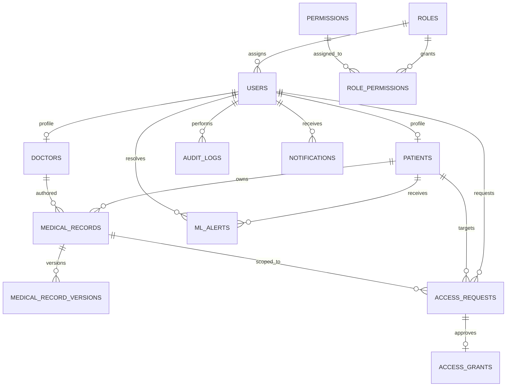

# MedChain PostgreSQL Database Design

## Overview

This document defines the PostgreSQL schema for the MedChain platform. The design supports secure medical data sharing, role-based access control, auditability, blockchain references, ML alerts, and notification delivery.

## Design Principles

- Privacy-preserving data handling
- Role-based access control
- Immutable auditability
- Blockchain-linked records
- Scalable indexing strategy
- Support for multi-tenant style separation where needed

## Core Conventions

- UUID primary keys are used for globally unique identifiers.
- Timestamps are stored in UTC.
- Soft-delete is used for user and record lifecycle management where appropriate.
- All sensitive data should be encrypted at rest and in transit.

---

## 1. Tables

### 1. Roles

Purpose:

- Define system roles for authorization.

Columns:

- id: UUID, PK
- name: VARCHAR(50), unique, not null
- description: TEXT
- created_at: TIMESTAMPTZ, not null
- updated_at: TIMESTAMPTZ, not null
- is_active: BOOLEAN, default true

Primary Key:

- id

Foreign Keys:

- None

Constraints:

- name unique
- is_active default true

Indexes:

- idx_roles_name on name

---

### 2. Permissions

Purpose:

- Define granular capabilities that can be granted to roles.

Columns:

- id: UUID, PK
- key: VARCHAR(100), unique, not null
- description: TEXT
- created_at: TIMESTAMPTZ, not null

Primary Key:

- id

Foreign Keys:

- None

Constraints:

- key unique

Indexes:

- idx_permissions_key on key

---

### 3. Role_Permissions

Purpose:

- Join table between roles and permissions.

Columns:

- role_id: UUID, PK/FK -> roles.id
- permission_id: UUID, PK/FK -> permissions.id
- created_at: TIMESTAMPTZ, not null

Primary Key:

- role_id, permission_id

Foreign Keys:

- role_id -> roles.id
- permission_id -> permissions.id

Constraints:

- Cascade delete from roles and permissions

Indexes:

- idx_role_permissions_role_id on role_id
- idx_role_permissions_permission_id on permission_id

---

### 4. Users

Purpose:

- Base identity table for all platform users.

Columns:

- id: UUID, PK
- email: VARCHAR(255), unique, not null
- password_hash: VARCHAR(255), not null
- full_name: VARCHAR(255), not null
- phone: VARCHAR(30)
- status: VARCHAR(30), default 'active'
- role_id: UUID, FK -> roles.id
- timezone: VARCHAR(64), default 'UTC'
- created_at: TIMESTAMPTZ, not null
- updated_at: TIMESTAMPTZ, not null
- last_login_at: TIMESTAMPTZ
- deleted_at: TIMESTAMPTZ

Primary Key:

- id

Foreign Keys:

- role_id -> roles.id

Constraints:

- email unique
- status in ('active','inactive','suspended','deleted')
- password_hash not null

Indexes:

- idx_users_email on email
- idx_users_role_id on role_id
- idx_users_status on status

---

### 5. Patients

Purpose:

- Patient profile information.

Columns:

- id: UUID, PK
- user_id: UUID, FK -> users.id, unique
- date_of_birth: DATE
- gender: VARCHAR(20)
- blood_group: VARCHAR(10)
- emergency_contact_name: VARCHAR(255)
- emergency_contact_phone: VARCHAR(30)
- consent_status: VARCHAR(30), default 'pending'
- created_at: TIMESTAMPTZ, not null
- updated_at: TIMESTAMPTZ, not null
- deleted_at: TIMESTAMPTZ

Primary Key:

- id

Foreign Keys:

- user_id -> users.id

Constraints:

- consent_status in ('pending','granted','revoked')

Indexes:

- idx_patients_user_id on user_id
- idx_patients_consent_status on consent_status

---

### 6. Doctors

Purpose:

- Doctor profile information.

Columns:

- id: UUID, PK
- user_id: UUID, FK -> users.id, unique
- specialization: VARCHAR(255)
- license_number: VARCHAR(100), unique
- hospital_affiliation: VARCHAR(255)
- years_experience: INT
- verification_status: VARCHAR(30), default 'pending'
- created_at: TIMESTAMPTZ, not null
- updated_at: TIMESTAMPTZ, not null
- deleted_at: TIMESTAMPTZ

Primary Key:

- id

Foreign Keys:

- user_id -> users.id

Constraints:

- license_number unique
- verification_status in ('pending','verified','rejected')

Indexes:

- idx_doctors_user_id on user_id
- idx_doctors_license_number on license_number
- idx_doctors_verification_status on verification_status

---

### 7. Medical_Records

Purpose:

- Core medical record storage.

Columns:

- id: UUID, PK
- patient_id: UUID, FK -> patients.id
- doctor_id: UUID, FK -> doctors.id, nullable
- record_type: VARCHAR(100), not null
- title: VARCHAR(255), not null
- summary: TEXT
- content_encrypted: TEXT, not null
- created_at: TIMESTAMPTZ, not null
- updated_at: TIMESTAMPTZ, not null
- version: INT, default 1
- is_deleted: BOOLEAN, default false
- hash_value: VARCHAR(128)

Primary Key:

- id

Foreign Keys:

- patient_id -> patients.id
- doctor_id -> doctors.id

Constraints:

- version >= 1
- hash_value unique nullable

Indexes:

- idx_medical_records_patient_id on patient_id
- idx_medical_records_doctor_id on doctor_id
- idx_medical_records_created_at on created_at
- idx_medical_records_is_deleted on is_deleted

---

### 8. Medical_Record_Versions

Purpose:

- Track document versions for historical integrity.

Columns:

- id: UUID, PK
- medical_record_id: UUID, FK -> medical_records.id
- version_number: INT, not null
- content_encrypted: TEXT, not null
- changed_by_user_id: UUID, FK -> users.id
- created_at: TIMESTAMPTZ, not null

Primary Key:

- id

Foreign Keys:

- medical_record_id -> medical_records.id
- changed_by_user_id -> users.id

Constraints:

- version_number >= 1

Indexes:

- idx_record_versions_medical_record_id on medical_record_id
- idx_record_versions_created_at on created_at

---

### 9. Access_Requests

Purpose:

- Request and grant workflow for accessing medical records.

Columns:

- id: UUID, PK
- requester_id: UUID, FK -> users.id
- patient_id: UUID, FK -> patients.id
- medical_record_id: UUID, FK -> medical_records.id, nullable
- request_type: VARCHAR(50), not null
- status: VARCHAR(30), default 'pending'
- reason: TEXT
- requested_at: TIMESTAMPTZ, not null
- reviewed_at: TIMESTAMPTZ
- reviewed_by: UUID, FK -> users.id, nullable
- expires_at: TIMESTAMPTZ
- created_at: TIMESTAMPTZ, not null

Primary Key:

- id

Foreign Keys:

- requester_id -> users.id
- patient_id -> patients.id
- medical_record_id -> medical_records.id
- reviewed_by -> users.id

Constraints:

- status in ('pending','approved','rejected','expired')
- expires_at > requested_at where present

Indexes:

- idx_access_requests_requester_id on requester_id
- idx_access_requests_patient_id on patient_id
- idx_access_requests_status on status
- idx_access_requests_requested_at on requested_at

---

### 10. Access_Grants

Purpose:

- Record approved temporary or scoped access permissions.

Columns:

- id: UUID, PK
- access_request_id: UUID, FK -> access_requests.id
- granted_to_user_id: UUID, FK -> users.id
- granted_by_user_id: UUID, FK -> users.id
- granted_at: TIMESTAMPTZ, not null
- expires_at: TIMESTAMPTZ
- scope: VARCHAR(100), default 'read'
- is_revoked: BOOLEAN, default false
- revoked_at: TIMESTAMPTZ

Primary Key:

- id

Foreign Keys:

- access_request_id -> access_requests.id
- granted_to_user_id -> users.id
- granted_by_user_id -> users.id

Constraints:

- scope in ('read','write','share')

Indexes:

- idx_access_grants_granted_to_user_id on granted_to_user_id
- idx_access_grants_expires_at on expires_at

---

### 11. Audit_Logs

Purpose:

- Record security and compliance events.

Columns:

- id: UUID, PK
- user_id: UUID, FK -> users.id, nullable
- entity_type: VARCHAR(100), not null
- entity_id: UUID
- action: VARCHAR(100), not null
- details: JSONB
- ip_address: INET
- user_agent: TEXT
- created_at: TIMESTAMPTZ, not null

Primary Key:

- id

Foreign Keys:

- user_id -> users.id

Constraints:

- action not null

Indexes:

- idx_audit_logs_user_id on user_id
- idx_audit_logs_entity_type_entity_id on entity_type, entity_id
- idx_audit_logs_created_at on created_at

---

### 12. Blockchain_Transactions

Purpose:

- Track blockchain transaction references for records and events.

Columns:

- id: UUID, PK
- tx_hash: VARCHAR(128), unique, not null
- chain_name: VARCHAR(50), not null
- network: VARCHAR(50), not null
- entity_type: VARCHAR(100), not null
- entity_id: UUID
- status: VARCHAR(30), default 'pending'
- block_number: BIGINT
- gas_used: BIGINT
- created_at: TIMESTAMPTZ, not null
- confirmed_at: TIMESTAMPTZ

Primary Key:

- id

Foreign Keys:

- None

Constraints:

- tx_hash unique
- status in ('pending','confirmed','failed','reverted')

Indexes:

- idx_blockchain_transactions_tx_hash on tx_hash
- idx_blockchain_transactions_status on status
- idx_blockchain_transactions_created_at on created_at

---

### 13. ML_Alerts

Purpose:

- Store alerts generated by ML modules.

Columns:

- id: UUID, PK
- patient_id: UUID, FK -> patients.id
- alert_type: VARCHAR(100), not null
- severity: VARCHAR(20), not null
- confidence_score: NUMERIC(5,4)
- title: VARCHAR(255), not null
- description: TEXT
- status: VARCHAR(30), default 'open'
- created_at: TIMESTAMPTZ, not null
- resolved_at: TIMESTAMPTZ
- resolved_by: UUID, FK -> users.id, nullable

Primary Key:

- id

Foreign Keys:

- patient_id -> patients.id
- resolved_by -> users.id

Constraints:

- severity in ('low','medium','high','critical')
- status in ('open','reviewed','resolved','dismissed')
- confidence_score between 0 and 1

Indexes:

- idx_ml_alerts_patient_id on patient_id
- idx_ml_alerts_status on status
- idx_ml_alerts_severity on severity
- idx_ml_alerts_created_at on created_at

---

### 14. Notifications

Purpose:

- Store in-app and outbound notifications.

Columns:

- id: UUID, PK
- user_id: UUID, FK -> users.id
- channel: VARCHAR(30), not null
- category: VARCHAR(50), not null
- title: VARCHAR(255), not null
- body: TEXT
- is_read: BOOLEAN, default false
- is_sent: BOOLEAN, default false
- created_at: TIMESTAMPTZ, not null
- sent_at: TIMESTAMPTZ

Primary Key:

- id

Foreign Keys:

- user_id -> users.id

Constraints:

- channel in ('in_app','email','sms','push')

Indexes:

- idx_notifications_user_id on user_id
- idx_notifications_is_read on is_read
- idx_notifications_created_at on created_at

---

## 2. Relationship Summary

- users -> roles
- users -> patients (one-to-one)
- users -> doctors (one-to-one)
- patients -> medical_records
- doctors -> medical_records
- medical_records -> medical_record_versions
- access_requests -> patients, users, medical_records
- access_grants -> access_requests, users
- audit_logs -> users
- ml_alerts -> patients, users
- notifications -> users

---

## 3. Mermaid ER Diagram

